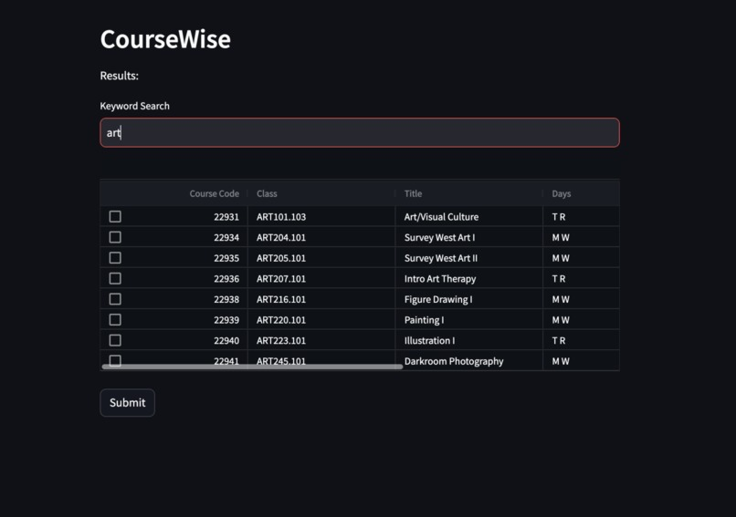
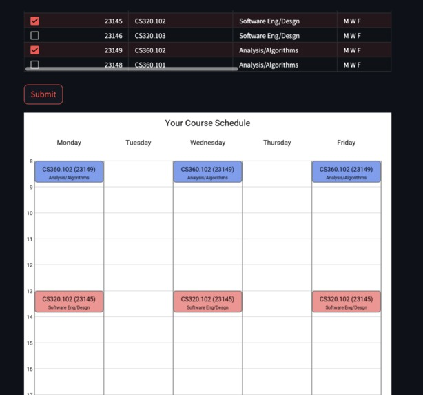
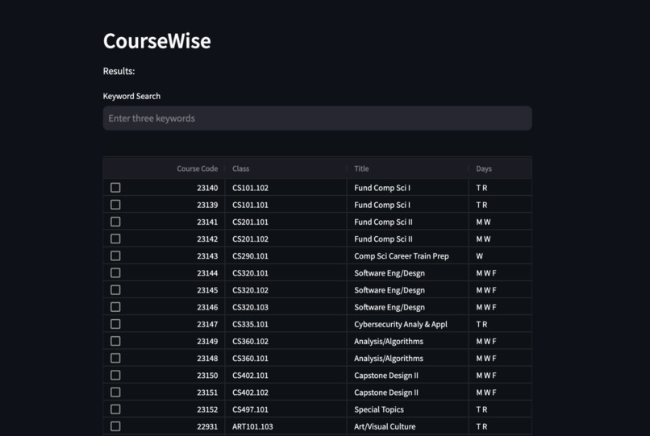
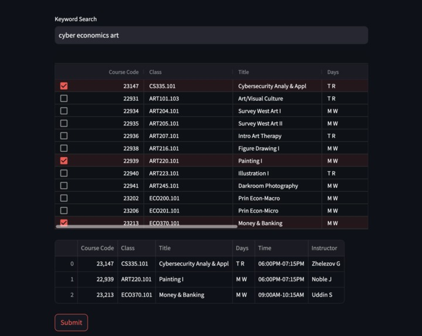

# CourseWise

CourseWise is a course planning tool that helps students explore course catalogs and generate a weekly class schedule.

The goal of the project was to simplify the process students go through before course registration opens. Instead of manually searching through course catalogs and checking for conflicts, CourseWise allows users to search courses, select the ones they want, and visualize their schedule.

This project was built during **YCP Hacks**, where it won:

- 🏆 Best Use of MongoDB Atlas  
- 🏆 Best Use of Streamlit  

---

# Demo

### Course Search Interface
Users can search the course dataset using keywords.

---

### Course Selection
Courses can be selected from the search results to build a schedule.

---

### Schedule Generation
After selecting courses, the program generates a weekly schedule visualization.

---

### Example Interface View

---

# How It Works

CourseWise loads course data from a CSV file and processes it using Python.

1. Course data is read from `csdata.csv`
2. The data is processed using **Pandas**
3. The interface is built with **Streamlit**
4. Users search courses using keyword queries
5. Selected courses are passed to the scheduling engine
6. A weekly schedule is generated using the calendar visualization system

The project also experiments with **MongoDB** for storing and organizing course information.

---

# Project Structure
fandmycphacks
│
├── registration.py # main Streamlit application
├── draw_schedule.py # schedule generation
├── class.py # course class representation
├── csdata.csv # course dataset
├── data.json
├── calendar_view/ # calendar rendering system
├── images/ # screenshots used in README
├── requirements.txt
└── setup.py

---

# Technologies

- Python
- Streamlit
- Pandas
- MongoDB (PyMongo)
- Git / GitHub

---

# What We Learned

This project was our first experience building an interactive application using **Streamlit** and integrating structured course data into a scheduling tool.

We learned how to:

- organize course data for querying
- build an interactive frontend with Streamlit
- generate visual schedule layouts
- collaborate using Git and GitHub during a hackathon

---

# Future Improvements

Some ideas discussed for future development:

- automatic replacement suggestions for conflicting courses
- instructor rating integration (RateMyProfessor)
- improved filtering and search tools
- support for multiple universities

---

# Team

- **Moemen Ibrahim**
- Jenn McNiff
- Vincent Pham
